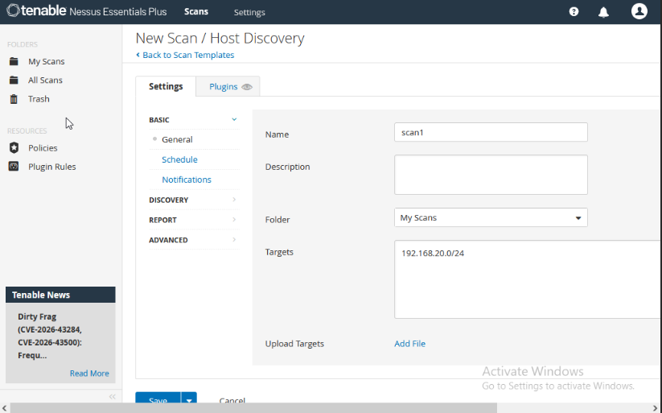
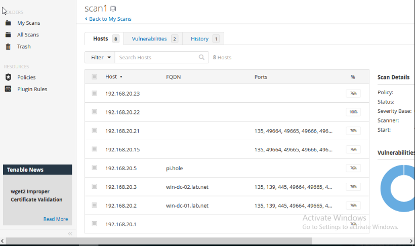

# Configuring a scan
## About
Following the installation of Nessus, we can perform our first scan.

## Environment
Note: All internal IP addresses, devices, and services are not part of a corporate environment. This environment was created to implement and test security tools, devices, prior to production use. 
IP Range: `192.168.20.0/24` 

## Procedure
Log into your Nessus web interface located at `https://<server_ip_address>:8834/`  
Select `Scans` in the top bar.
     This will take you to the `Scans` location, where you can see previous or in-progess scans.  
Select `Create a new scan.`  
There are a variety of scan options, which are out-of-scope for this demo.
     In this instance, we will perform `Host Discovery`, which will discover live hosts and open ports.  
Select `Host Discovery`.  
    This will prompt you to the `Settings` page for the scan  

</img>
  
There are various settings that you can configure for the scan to meet your constraints or requirements. 
    - Discovery: Configure what type of scan, and ports you want to use. 
    - Assessment: What type of assessment you want to perform such as full web application scanning. 
    - Report: Configure the scan's verbosity and what you want to see in the report 
    - Advanced: Where you can configure more advanced options, such as how many hosts you would scan at the same time 
    - Plugins: Where you can select different plugins, such as Cisco specific ones, or Unix based ones. 
 
Input a name for the scan, I've used `scan1`.
  
Next, input targets, for this demo I've used `192.168.20.0/24` for my current network.  

Then proceed to save the scan by clicking `Save`
  

One you've saved the scan, you can proceed to `My Scans` to view the newly saved scan. 
  

Finally, you can launch it by clicking the little play icon on the right of the scan
  

Once complete you'd be able to see a list of hosts and their open ports!
  
</img>

## Conclusion
Scanning for vulnerabilites on a regular basis enhances network security by proactively looking for network weaknesses allowing a method to inventory and track current vulnerabilities on our endpoints.

## Additional Learning
TryHackMe's Tenable Nessus Room located <a href='https://tryhackme.com/room/rpnessusredux'>here</a>.  
Nessus Documentation located <a href='https://docs.tenable.com/Nessus.html'>here</a>.

