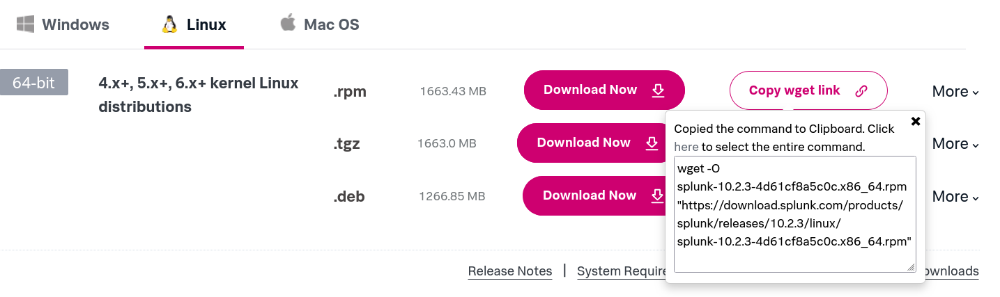
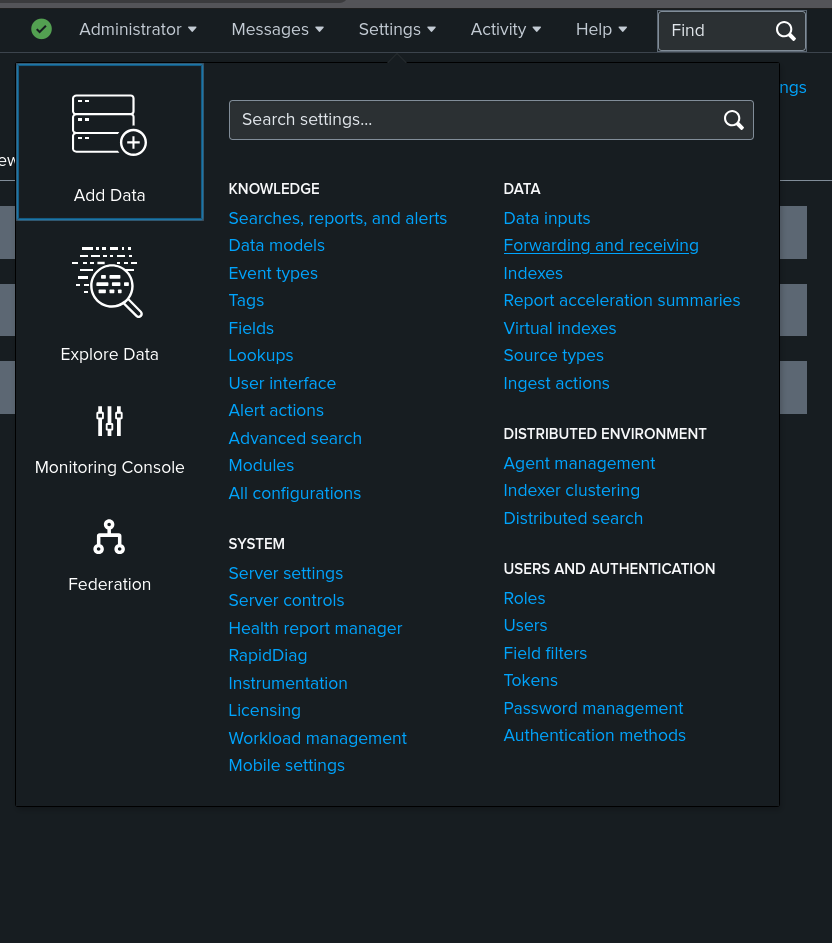

# About
This project covers the install of Splunk Enterprise and configuration of Splunk Forwarder on an endpoint. I've wanted to apply my strong foundation with triaging and event correlation tying it with an industry-standard solution. 

# Prerequisites
I've provisioned a virtual machine running Red Hat Enterprise Linux (RHEL) 8.10 with a 12 core vCPU, 12GB of memory, and 150 GB of storage. This is enough for my environment. System requirements can be found Splunk's website.

# Procedure
1. Signed up for an account on <a href='https://splunk.com'>Splunk</a>.  
2. Clicked on `Trials & Downloads`.  
</img>  
3. Scrolled down to `Splunk Enterprise` and clicked on `Start Free Trial`.  
4. Since I've already installed Linux, I've selected `Linux` and selected the `Copy wget link` by RPM. You will need to select the appropriate download for your OS.  
</img>  
5. Remote accessed my Linux install, opened a terminal prompt, and proceeded to elevate to root.   
6. Created a directory for the Splunk installation at `/opt/splunk`.  
7. Changed directories to `/opt/splunk` and pasted the wget command to download Splunk's installation package for Linux RPM.  
8. Installed the package using `rpm -i <forwarder_package>`.  
9. Accepted the license agreement and proceeded to create administrator credentials.  
10. Navigated to the bin directory for Splunk, in this case it was `/opt/splunk/bin`.  
11. Started Splunk with `./splunk start` which will have you accept a license agreement.  
12. Once completed, I've navigated to `https://<splunk_installation_ip>:8000/` for the Splunk dashboard, and sign in with the credentials I've created during the installation.  

# Receiver Configuration
Once we've installed Splunk, we now need to configure a receiving port so we may install forwarders to send logs to the Splunk instance.  

1. Logged into the Splunk dashboard at `https://<splunk_installation_ip>:8000/`.  
2. In the tool bar, navigated to `Settings > Add Data > Forwardng and receiving`.  
</img>  
3. Clicked on `Configure receiving` then on `New Receiving Port` then inputted `9997`  
4. The instance is now configured and ready to receive. At this point, I've amended firewall rules to allow traffic to the device and the specified port.  

# Forwarder Configuration
At this point, I've proceeded to install the Splunk Universal Forwarder on a DNS server.  

1. Navigated to the Splunk Universal Forwarder's website, located <a href='https://www.splunk.com/en_us/download/universal-forwarder.html'>here</a>.  
2. Loged into the shell for my Linux instance, and elevated to root privileges.  
3. created the `/opt/splunkforwarder` directory.  
4. Downloaded and installed the forwarder to the `/opt/splunkforwarder` directory.  
5. Navigated to the `/opt/splunkforwarder/bin` directory and ran `./splunk start` then accepted the license agreement.  
6. While still in `/opt/splunkforwarder/bin`, used `./splunk add forward-server <splunk_installation_ip>:<port>`. E.g. `splunk.lab.net:9997` to add the forwarder server.  
7. Finally, used `./splunk add monitor /var/log/audit/audit.log` to add the `audit.log` of Auditd for forwarding.   
8. Navigated back to the Splunk dashboard, then to `Search & Reporting`.  
9. In the search box inputted `Index=* source="/var/log/audit/audit.log"`. Verifying that the Splunk instance is receiving logs from my forwarder.

# Conclusion
Installing Splunk allows me to apply Splunk specific syntax along with getting used to Splunk's interface. I've wanted a means of aggregating logs from my firewalls and servers to have full network visability into my network traffic.
A future step will include creating custom alerts for TTPs used by APTs.   
# References
https://splunk.com/  
https://help.splunk.com/en/data-management/forward-data/universal-forwarder-manual/9.1/configure-the-universal-forwarder/configure-the-universal-forwarder-using-configuration-files  
https://www.splunk.com/en_us/download/universal-forwarder.html  

