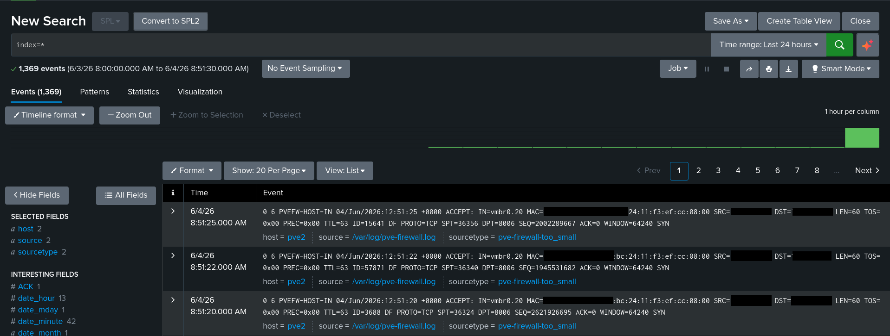
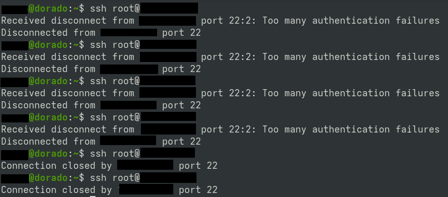
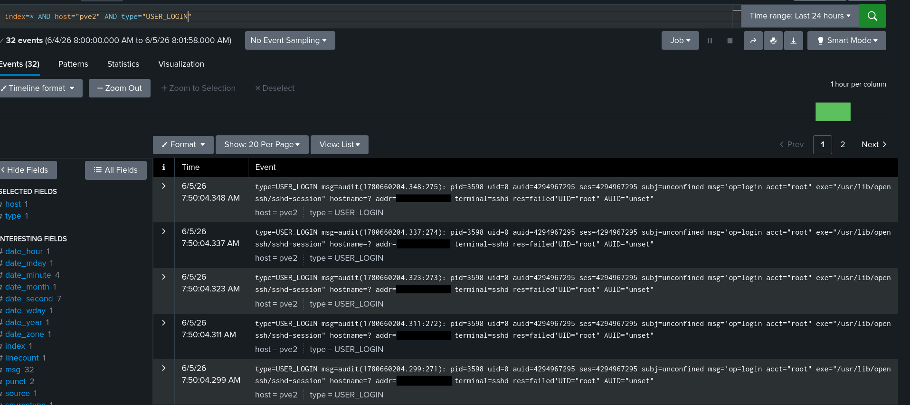

## Overview
This section shows failed logon detection for Splunk Enterprise.

## Detection

I navigated to the Splunk dashboard, then to `Search and Reporting`.

Searched for `Index=*` as this will allow me to view all events.

</img>

Opened a new terminal on my Linux instance and attempted multiple ssh attempts with the user `root`

</img>

I've searched for `index=* AND host="pve2" AND type="USER_LOGIN"` to view user login events, both successful and unsuccessful. As we can see we can find the brute force attempts for as root on the host.

We can deduce a brute force attempt by a given amount of attempts in a period of time, e.g. 50 attempts in 10 minutes. 

We can further investigate the source of the brute force attacks to determine what device the attempts are originating from. As an active response, we can apply a firewall rule on the host's or network network firewall to prevent further attempts. We can also modify `sshd_config` on how many attempts may be performed before a timeout is applied.
## Conclusion
This lab demonstrated the detection of a brute force SSH attack using Splunk Enterprise and custom SPL queries. By querying index=*, filtering on host="pve2" and type="USER_LOGIN", and analyzing authentication activity for the root account, I was able to identify a high volume of failed login attempts within a short time window, a clear indicator of brute force behavior.

This exercise highlights the importance of centralized log ingestion, authentication monitoring, and threshold-based detection for identifying credential attacks. By establishing baselines and defining alert conditions (e.g., excessive failed logins within a defined timeframe), Splunk can be leveraged as an effective detection and investigation platform within a SOC environment.

<a href="../README.md">Back to README</a>